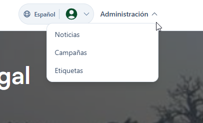
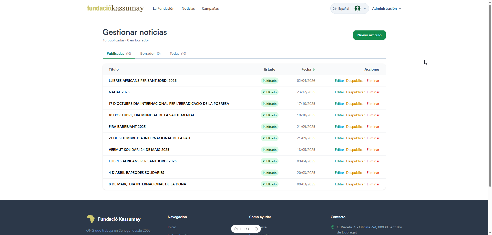
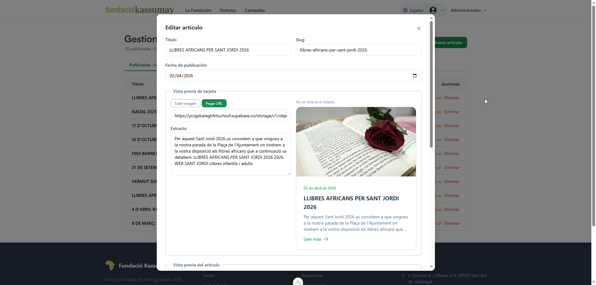
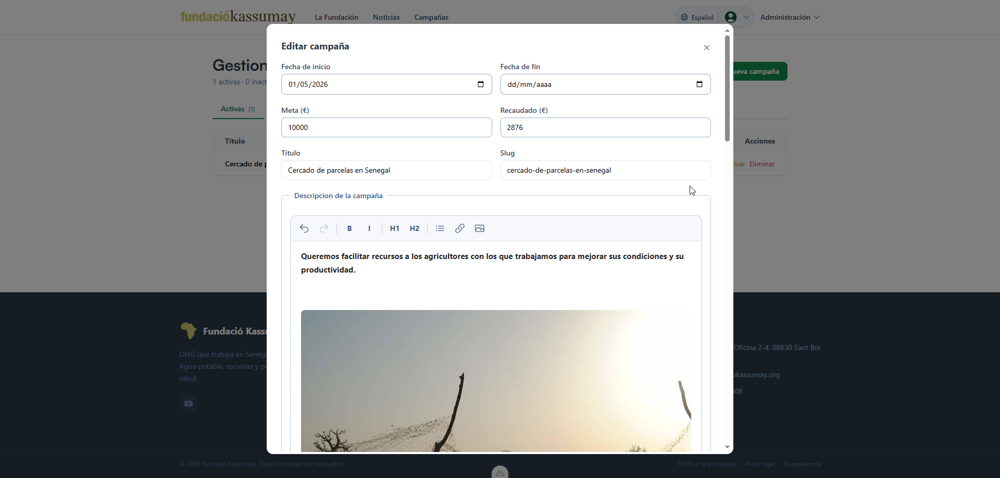
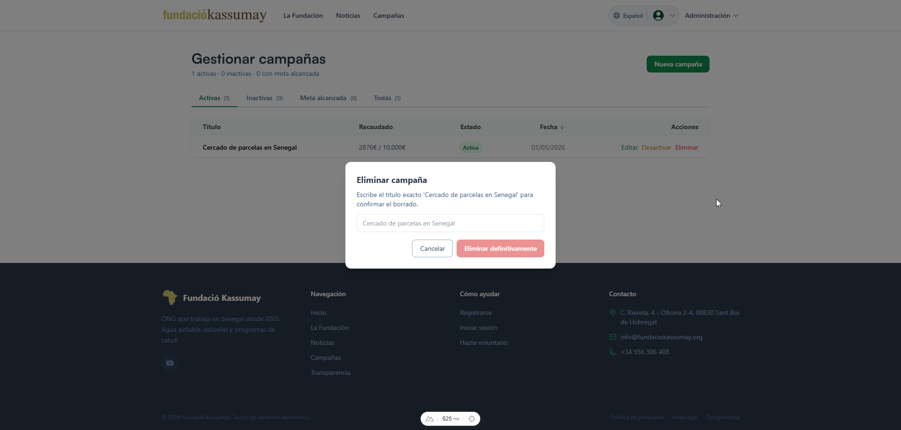
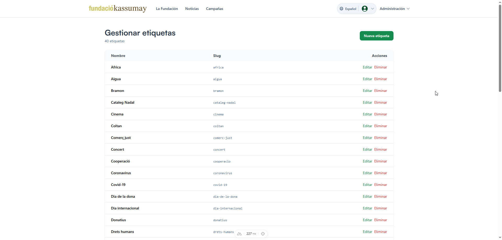

# Manual de administrador

Solo accesible si tu usuario tiene rol **ADMIN** en la base de datos.
Si entras con un USER normal no veras el menu y las URLs `/admin/*` te
echan a la home.

## Menu de admin

Logueado como ADMIN, en la cabecera aparece un desplegable con los
tres apartados: noticias, campañas y etiquetas.

## Noticias

Tabla con todas las noticias y botones de editar / borrar. Al pulsar
**Nueva noticia** se abre un formulario con titulo, resumen, imagen de
portada, contenido (editor TipTap) y etiquetas.

La imagen de portada admite URL externa o subida de archivo. El editor
de contenido tiene formato basico (negrita, listas, enlaces, imagen) y
un contador de caracteres abajo.

## Campañas

Igual que noticias pero el formulario tiene ademas meta de
recaudacion, recaudado actual, fechas y estado. La barra de progreso
del frontend se calcula con esos dos numeros.

Borrar campañas pide confirmacion en un dialogo, no se hace de un solo click.

## Etiquetas

Listado simple. Crear pide solo el nombre, el slug se genera solo a
partir de el. Borrar una etiqueta no borra los contenidos asociados,
solo deshace la relacion.

## Validacion y errores

Los formularios validan en directo (campos requeridos, tamaño minimo
del contenido, imagen obligatoria). Los errores de servidor (subida
fallida, error al guardar) salen como toast arriba.

## Sobre la seguridad

El acceso esta protegido en dos sitios: el middleware del frontend
redirige si no eres ADMIN, y las RLS de Supabase bloquean cualquier
escritura desde un usuario sin ese rol aunque se salte el frontend.
