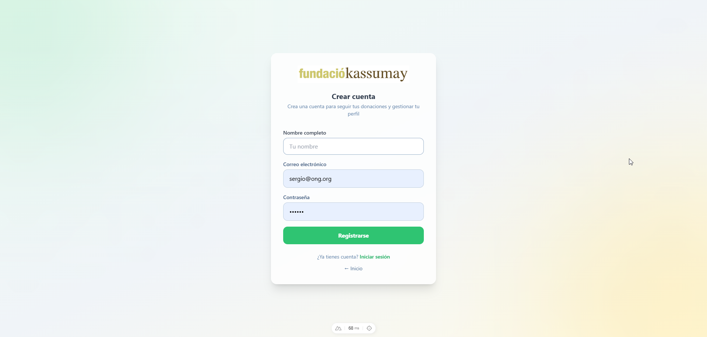
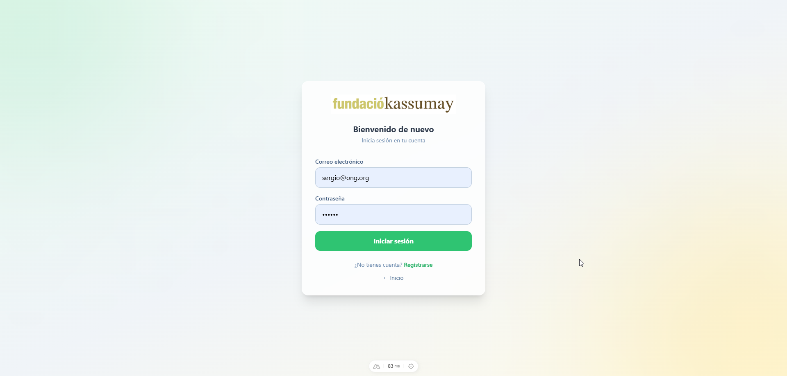
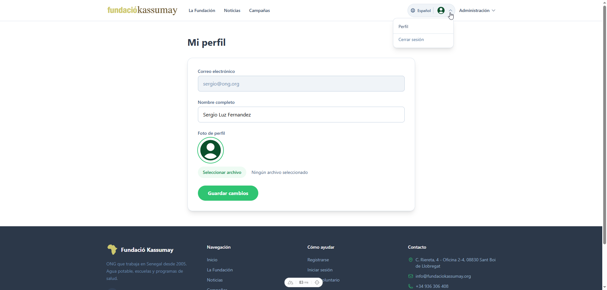
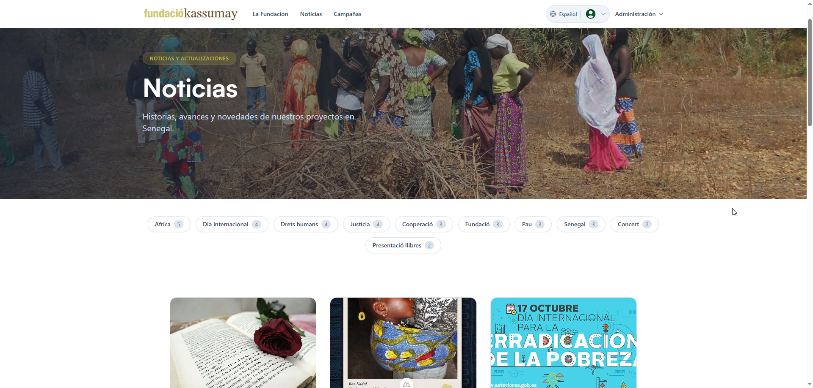
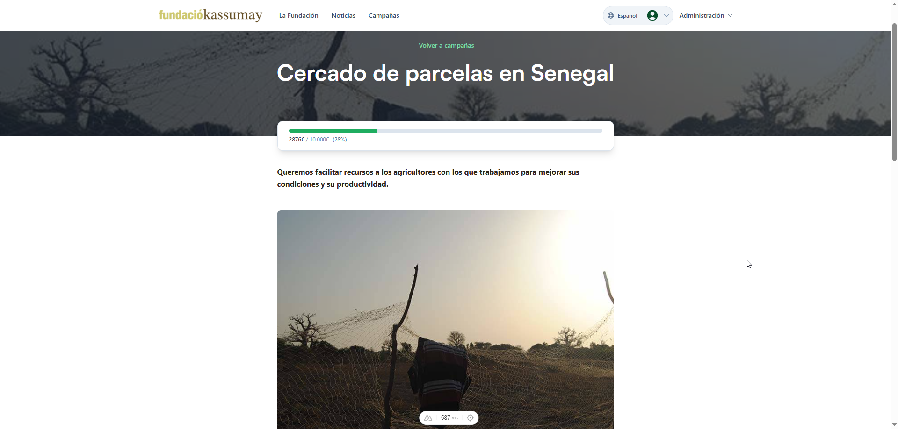

# Manual de usuario

Lo basico para usar la plataforma. Si vas a gestionar contenido mira el
[manual de admin](manual-admin.md).

## Registro y login

Arriba a la derecha tienes **Registrarse**. Pones email y contraseña,
te llega un correo, pulsas el enlace que viene dentro y la cuenta queda
activada. A partir de ahi entras desde **Iniciar sesion**.

## Navegar por el sitio

En la cabecera tienes los apartados principales (Fundacion, Noticias,
Campañas) y a la derecha el selector de idioma. Esta en español,
catalan, ingles y frances.

## Perfil

Cuando estas logueado, en tu avatar arriba a la derecha entras a
**Perfil**. Puedes cambiar nombre, bio y foto. Al guardar te sale un
aviso de que ha ido bien.

## Noticias y campañas

Las dos paginas son lo mismo en cuanto a uso: listado de cards, y
arriba las etiquetas mas usadas para filtrar. Click en una card para
ver el detalle.

En el detalle de campaña hay ademas un widget con el progreso de
recaudacion.

## Cerrar sesion

Desde el menu del avatar.
